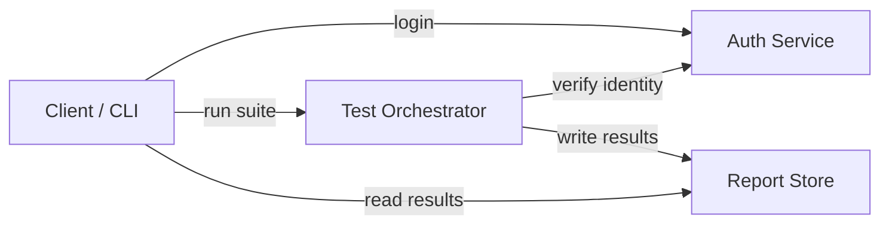

# System Architecture

High-level view of the Software Quality Platform. Kept in Mermaid so
changes show up in Git diffs and can be reviewed like any other file.

## Components

- **Auth Service** — user registration and credential verification.
  Draft implementation lives in `src/auth/`.
- **Test Orchestrator** — discovers and runs test suites in a stable
  order; entry point is `tests/orchestration.py`.
- **Report Store** — will persist run results and progress summaries;
  not yet implemented.

## Notes

- The Auth Service and Test Orchestrator are independent and can be
  developed in parallel on separate feature branches.
- The Report Store is intentionally left abstract until requirements
  are firmed up in `docs/requirements.md`.
