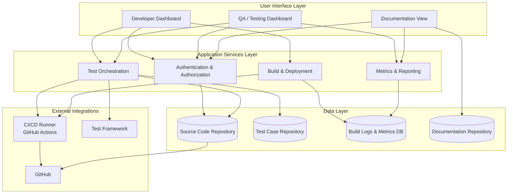

# System Architecture

Layered architecture for the Software Quality Platform. Components are
organized into distinct tiers that interact through well-defined
interfaces, which supports separation of concerns and keeps the system
easier to maintain and extend (Walker, 2022; ByteMonk, 2024).

The diagram is kept in Mermaid so changes are visible in Git diffs and
can be reviewed like any other file.

## Layers

### User Interface Layer
- **Developer Dashboard** — surfaces build, test, and deployment status
  for engineers actively working on the code.
- **QA / Testing Dashboard** — surfaces test-run history, failing
  suites, and coverage trends for QA.
- **Documentation View** — read-only view over the documentation
  repository.

### Application Services Layer
- **Authentication & Authorization** — identity verification and
  role-based access control (see `docs/module_design.md`).
- **Test Orchestration** — event-driven execution of automated unit
  and integration tests.
- **Build & Deployment** — compiles the application and prepares
  deployment artifacts, gated on successful tests.
- **Metrics & Reporting** — aggregates quality metrics and exposes
  dashboards and trend reports.

### Data Layer
- **Source Code Repository** — the versioned source of truth for the
  platform's code.
- **Test Case Repository** — versioned test scripts and configuration.
- **Build Logs & Metrics DB** — historical build results, coverage,
  and defect counts.
- **Documentation Repository** — technical docs, design notes, and
  progress writeups.

### External Integrations
- **GitHub** — hosts the source and documentation repositories.
- **CI/CD Runner (GitHub Actions)** — executes orchestrated pipelines
  on push and pull-request events.
- **Test Framework** — the underlying framework used to run individual
  suites (Go's standard `testing` package via `go test -json`).

## Notes

- Higher layers depend only on the layer immediately below them via
  the interfaces shown above; this keeps the coupling directional and
  the system easier to evolve.
- Detailed module specifications (inputs, outputs, methodology) live
  in `docs/module_design.md`.
