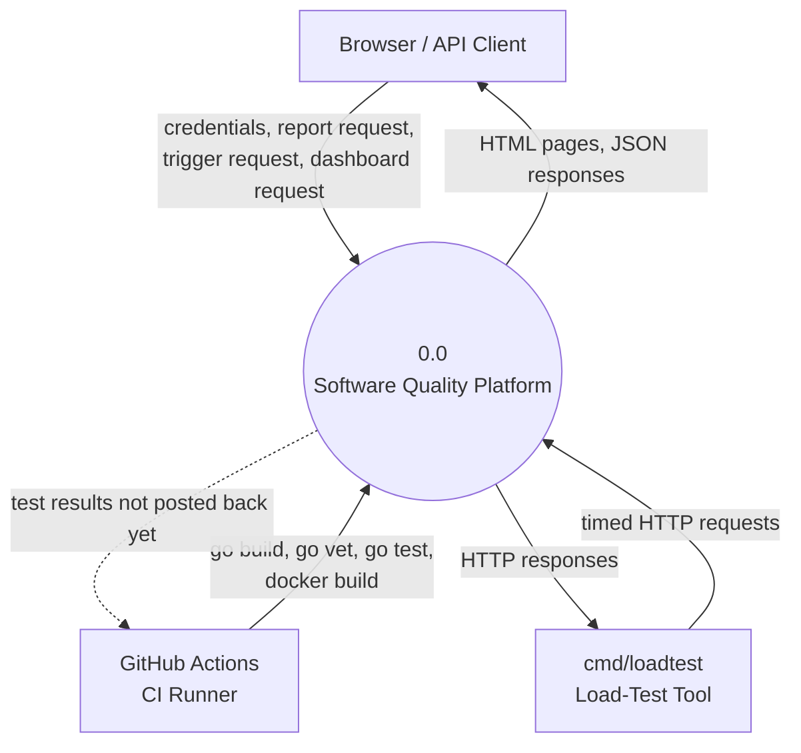
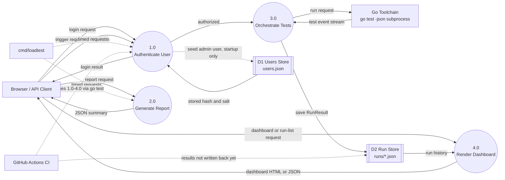

# Data Flow Diagram

Where the architecture diagram shows structural layers, this diagram shows how data actually moves between the client, the platform's internal processes, and its data stores, using standard DFD notation: external entities as rectangles, processes as numbered circles, and data stores as double-bar boxes. Solid arrows are live, request-driven flows; dashed arrows are startup-only or external verification flows that do not run on every request.

## Context Diagram (Level 0)

## Level 1 DFD

## Processes

- 1.0 Authenticate User: verifies a username/password pair (PBKDF2-HMAC-SHA256, constant-time compare) and also guards the trigger endpoint via HTTP Basic credentials. Implemented in `internal/auth`.
- 2.0 Generate Report: summarizes a fixed, in-memory set of test outcomes into total/passed/failed counts and a pass rate. Implemented in `internal/reporting`. Stateless; touches no data store.
- 3.0 Orchestrate Tests: runs `go test -json` against the configured repository, parses the event stream into a structured result, and persists it. Implemented in `internal/orchestration`.
- 4.0 Render Dashboard: reads run history back from the data store and renders it as HTML (`GET /`) or JSON (`GET /api/runs`). Implemented in `internal/web`.

## Data stores

- D1 — Users Store (`users.json`): one JSON file holding all registered users. Read on every authentication check; written only via `Register`, which in the current implementation is only invoked once, at server startup, to seed the administrative account — there is no public registration endpoint yet, so live write traffic to D1 does not occur.
- D2 — Run Store (`runs/*.json`): one JSON file per test run, written by 3.0 and read by 4.0. This is the only store with live, request-driven writes.

## External entities

- Browser / API Client: the only entity that drives live request traffic into the four processes.
- cmd/loadtest: issues real HTTP requests to measure latency and throughput; a read-only, external verification flow, not part of the application's own data path.
- GitHub Actions (CI): builds and tests the application on every push, including the integration tests that exercise processes 1.0-4.0 over a real HTTP connection, but its results are not currently written into D2. Closing that gap is the subject of `docs/ci_dashboard_integration_design.md`.
